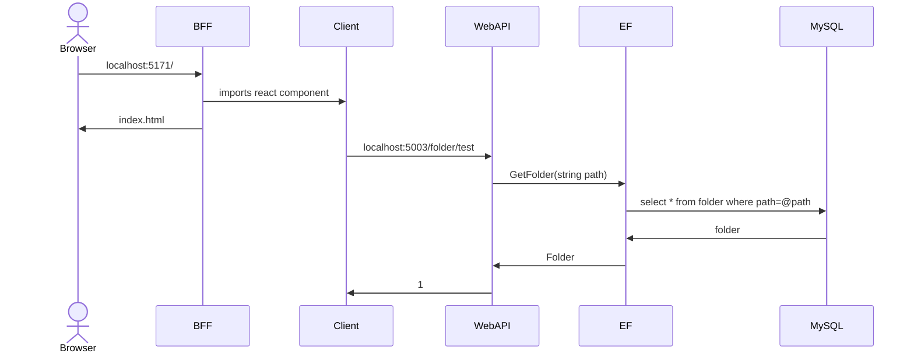

# filestorage
Example file storage project which contains scaffolding for web application using ReactTs on the client side with ReactTs BFF server and .Net core web api middle tier with EntityFramework and MySql data provider.
Below is a high level sequence diagram of project flow

  
BFF: FileStorage.React.Server  
Client: FileStorage.React.Client  
WebAPI: FileStorage.Web.ApiControllers  
EF: FileStorage.Repository.EF  
MySQL: is MySqk database  

# How to run
1. You need to create MySql db locally, I used MySql docker image. And create folder table with ID, and Path columns.
2. In FileStorage.Net/FileStorage.Web.ApiControllers/App.config file you specify connection string to your MySql DB.
3. dotnet run FileStorage.Net/FileStorage.Web.ApiControllers. url is defined in FileStorage.Net/FileStorage.Web.ApiControllers/appsettings.Development.json
4. Go to FileStorage.Net/FileStorage.React.Server and npm i.
5. dotnet run FileStorage.Net/FileStorage.React.Server it should build FileStorage.React.Client as well, because it is defined as on build command in FileStorage.React.Server.csproj.

After that you should be able to run entire app. 